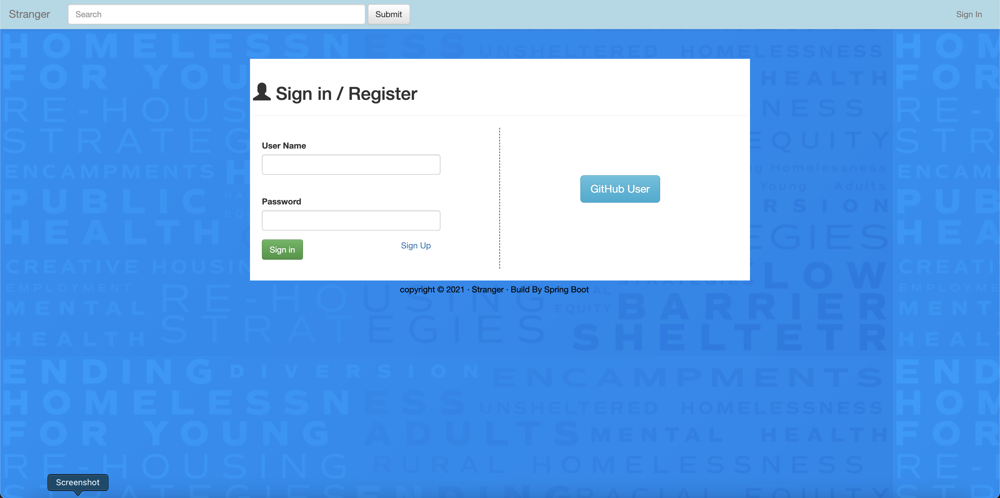
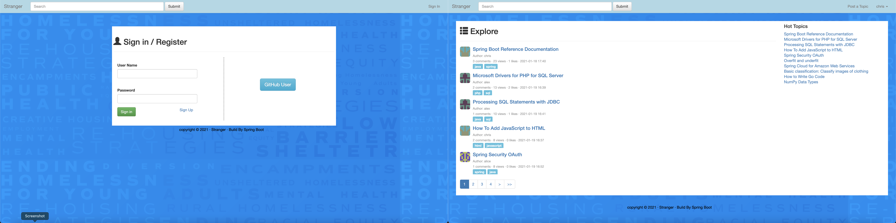
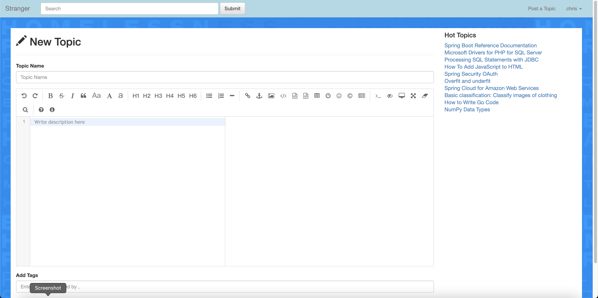
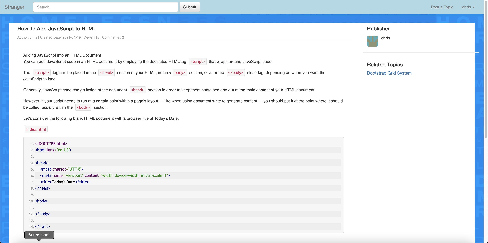
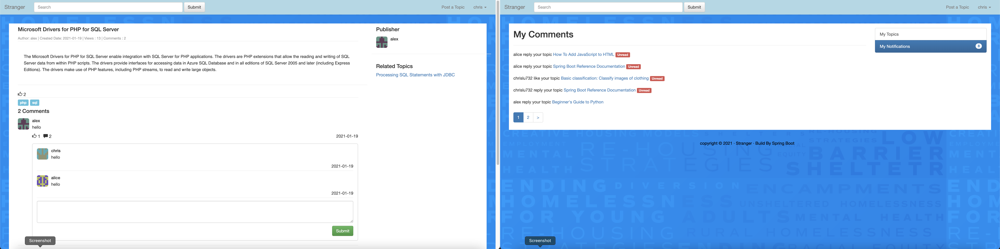
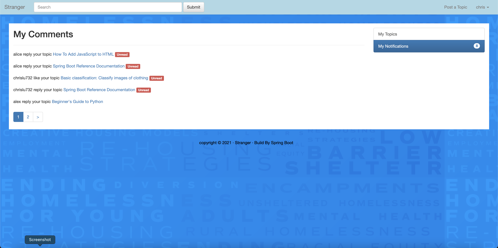
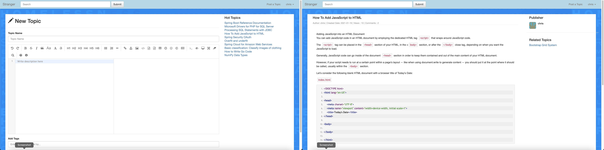
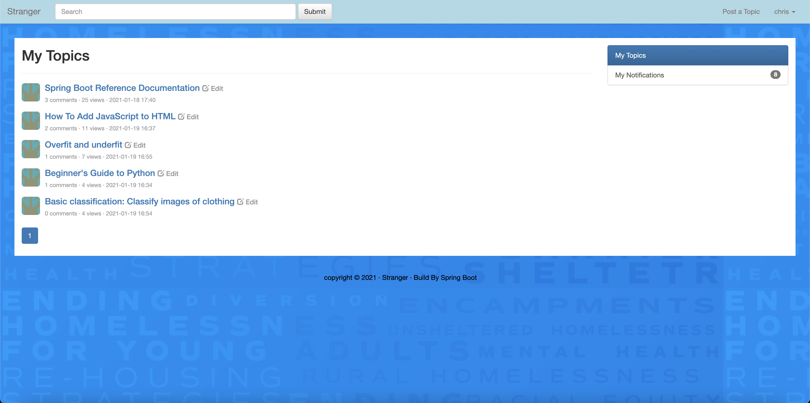

# Stranger

English / [中文](README_ZH.md)

## Introduction

**Stranger** is a web application developed based on **Spring Boot**. It is a demo of a community forum. The main functions include user registration and login, posting, replying, real-time updated hot topic rankings and message reminders. The database uses **h2 database** ,and **MyBatis** is used to read and write the database.

## What can the community do ?

#### Sign In / Sign Up

This application implements a basic user management system. Users can register and log in through the username and password or **github**. It uses the token-based authentication to maintain the user's login status.

#### Post Topic

Users can easily post topics in this application. The main content of the topic can be written in ordinary text or **markdown** grammar. The plug-in used is ***pandao***'s open source markdown online editor ***Editor.md***. Users can modify or adjust the published topics at any time.

#### Reply / Like / Notification

Users can comment or like under any topic, and be able to make secondary comments and likes under any comment. Users who have been commented or liked can view these replies and likes through the notification center.

#### Search Topics / Related Topics / Hottest Topics

Users can use the search box in the navigation bar to search for topics they want to know. The right bar of each topic will display topics related to the current topic. In addition, the hottest topic rankings are displayed in real time on the right bar of the homepage and some other pages. This ranking is implemented using the timing task of **Spring Boot**.

- ## Environment

- **IntelliJ IDEA 2019 +**

- **Java 1.8 +**

- **Maven 3.6 +**

- **Spring Boot 2.4 +**

- **H2 1.4 +**

- **MyBatis 3 +**
